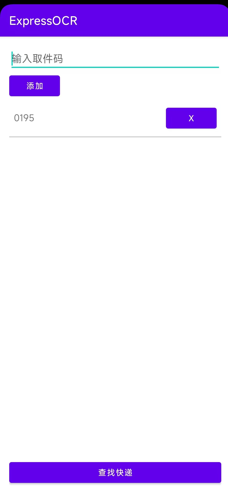
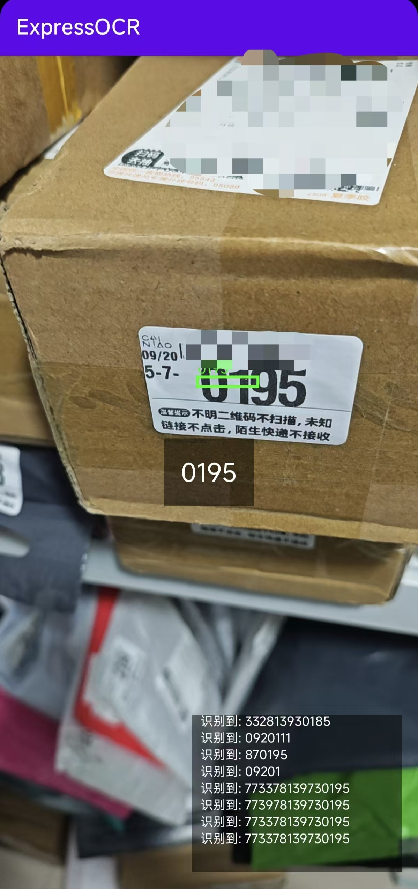

# Express OCR Scanner

一个简单的 Android 应用，用于通过摄像头实时扫描和识别文本，并高亮显示预设的快递单号或特定编码。

## ✨ 功能

-   **实时文本识别**: 使用设备摄像头实时捕捉和分析视频流中的文本。
-   **目标编码高亮**: 当识别到的文本包含预设的编码时，该编码会高亮显示在屏幕中央。
-   **精确框选**: 在识别到的目标文本周围绘制边界框。
-   **实时日志**: 在屏幕右下角显示实时识别到的数字串，方便调试和观察。
-   **声音提示**: 成功匹配到目标编码时播放提示音。

## 📸 截图



## 🛠️ 技术栈

-   **语言**: [Kotlin](https://kotlinlang.org/)
-   **异步**: [Coroutines](https://kotlinlang.org/docs/coroutines-overview.html)
-   **相机**: [Android CameraX](https://developer.android.com/training/camerax)
-   **文字识别**: [Google ML Kit Text Recognition](https://developers.google.com/ml-kit/vision/text-recognition)

## 🚀 如何运行

1.  **克隆仓库**
    ```bash
    git clone https://github.com/baso4/ExpressOCR.git
    ```

2.  **打开项目**
    使用 Android Studio Koala Feature Drop | 2024.1.2 或更高版本打开项目。

3.  **构建并运行**
    等待 Gradle 同步完成后，直接点击 "Run" 按钮将应用安装到你的 Android 设备或模拟器上。

## 📝 使用方法

1.  在启动 `CameraActivity` 前，通过 `Intent` 传入一个待扫描的字符串列表。
    ```kotlin
    val intent = Intent(this, CameraActivity::class.java).apply {
        putStringArrayListExtra("codes", arrayListOf("1234", "5678"))
    }
    startActivity(intent)
    ```
2.  打开应用，将摄像头对准包含快递单号的文本。
3.  如果识别到匹配的单号，屏幕上会显示单号、绘制边框并发出提示音。

## 📄 开源许可

本项目采用 [MIT License](LICENSE) 开源许可。